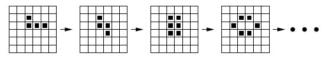

# Game Of Life.

## Game description.
The game described below is inspired by the Game of Life invented by John Conway in the early seventies. It consists in simulating a simple cellular automaton: cells are placed into a square grid of arbitrary size. At each step, the game determines whether those cells must live or die by applying the following rules:
* If a cell is surrounded by 2 or 3 other cells, it lives.
* If a cell is surrounded by 0 or 1 other cell, it dies of loneliness.
* If a cell is surrounded by 4 cells or more, it dies by asphyxiation.
* If a square of the grid is empty, but surrounded by exactly 3 cells, a new cell is created on this square.
* When a cell dies, it disappears from the grid.

To determine which cells surround a given square of the grid, one takes into account its adjacent squares in the horizontal, vertical and diagonal directions (in other words, its 8 neighboring squares for locations that do not belong to a border). At each step, one first decides for the whole population which cells are going to die, survive, or be created, before modifying this population.

<p align="center">
  <br>
  Fig. 1: example of a population stabilizing after a few generations.
</p>

## Code specifications.
This project is a Java program that successively displays the populations generated from an initial one. This initial population must be obtained by placing cells randomly in a square region located at the center of the grid. The size `n * n` of the grid and the size `m * m` of this square region must be defined by two parameters `n` and `m` provided by the user upon launching the program. The program check the constraint `0 < m <= n`, as well as the requirement that `n` and `m` share the same parity, otherwise, an error message should be displayed. 

In addition to simulating the population evolution, the program also count the number of cells that are created, as well as those that die, on each square belonging to the left and right borders of the grid. Populations are displayed as text, cells being represented by the symbol `*` and empty squares by `-`. For each square on the left and right borders, the number of cells that have been created (`+`) or that have died (`-`) should also be displayed. 
For exemple, we have a game state such as follow
```
[+ 1/- 0] * - - - - - [+ 0/- 0]
[+ 2/- 2] - * - * - - [+ 0/- 0]
[+ 6/- 6] - * * - - - [+ 2/- 2]
[+ 3/- 3] - - * - - - [+ 1/- 1]
[+ 1/- 1] - * - * - - [+ 1/- 1]
[+ 2/- 1] * - - - - - [+ 0/- 0]
```
## Usage.
This command line program can be launch by 
```
java GameOfLife
```
and then following the instructions provided in the menu.
